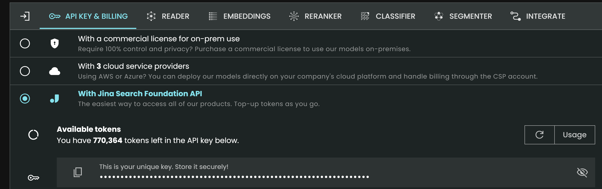

# Web scraper


<!-- WARNING: THIS FILE WAS AUTOGENERATED! DO NOT EDIT! -->

Reference: - [YouTube: Add Any Docs to Replit’s AI
Chat](https://www.youtube.com/watch?v=VLT08ugfpvA&t=2s) - [Replit:
docs2md](https://replit.com/@matt/docs2md?v=1&utm_source=matt&utm_medium=youtube&utm_campaign=tutorials)

``` python
import logging
import os
import time
from urllib.parse import urlparse

import treq
from scrapy.crawler import CrawlerProcess
from scrapy.linkextractors import LinkExtractor
from scrapy.spiders import CrawlSpider, Rule
from slugify import slugify
logger = logging.getLogger(__name__)
```

Indicate the doc web, need to have https://docs.. format

``` python
DOCS_URL = "https://docs.fastht.ml"
```

Get JINA api token from https://jina.ai/

Scroll down the page, copy API

<figure>

<figcaption aria-hidden="true">image.png</figcaption>
</figure>

``` python
os.environ['JINA_API_KEY'] =''
```

``` python
def urljoin(*args):
  """
  Joins given arguments into an url. Trailing but not leading slashes are
  stripped for each argument.
  """

  return "/".join(map(lambda x: str(x).rstrip('/'), args))


class MarkdownPipeline:

  def create_directory_from_url_with_slug(self, url):
    parsed_url = urlparse(url)
    path_segments = parsed_url.path.strip('/').split('/')
    directory_path = './docs/' + self.collection
    for segment in path_segments[:-1]:
      directory_path = os.path.join(directory_path, segment)
      os.makedirs(directory_path, exist_ok=True)
    filename = slugify(path_segments[-1])
    return os.path.join(directory_path, filename)

  def open_spider(self, spider):
    self.collection = spider.domain.title().replace('.', '')
    os.makedirs(f'./docs/{self.collection}', exist_ok=True)

  async def process_item(self, item, spider):
    response = await treq.get('https://r.jina.ai/' + item.get('url'),
                              headers={
                                  'Content-Type':
                                  'text/plain',
                                  "Authorization":
                                  f"Bearer {os.environ['JINA_API_KEY']}"
                              })

    content = await response.text()
    url = item.get('url')

    directory = self.create_directory_from_url_with_slug(url)

    with open(directory + '.md', 'w') as f:
      f.write(content)

    return item

  def close_spider(self, spider):
    self.client.close()


class PagingIncremental(CrawlSpider):
  name = "docs"
  custom_settings = {
      'DOWNLOAD_DELAY': '0',
      'FEED_EXPORT_ENCODING': 'utf-8',
      'DEPTH_LIMIT': '0',
      'AUTOTHROTTLE_ENABLED': 'True',
      'AUTOTHROTTLE_START_DELAY': '1',
      'AUTOTHROTTLE_MAX_DELAY': '3',
      "AUTOTHROTTLE_TARGET_CONCURRENCY": '1'
  }
  rules = (Rule(LinkExtractor(allow=r""), callback='parse', follow=True), )

  def __init__(self, url, *args, **kwargs):
    super().__init__(*args, **kwargs)
    # Visit all found sublinks
    print(url)
    self.domain = urlparse(url).hostname
    self.domain_name = self.domain.split('.')[1]
    self.allowed_domains = [self.domain]

    self.start_urls = [url]

  def parse(self, response):

    item = {}
    item["url"] = response.url
    time.sleep(.1)
    yield item


def process_docs(url):
  process = CrawlerProcess({
      'USER_AGENT': 'Mozilla/5.0',
      'ITEM_PIPELINES': {
          '__main__.MarkdownPipeline': 1,
      },
  })

  process.crawl(PagingIncremental, url=url)
  process.start(stop_after_crawl=True)


if __name__ == "__main__":
  process_docs(DOCS_URL)
```

If in jupyter:

``` python
process_docs(DOCS_URL)
```
